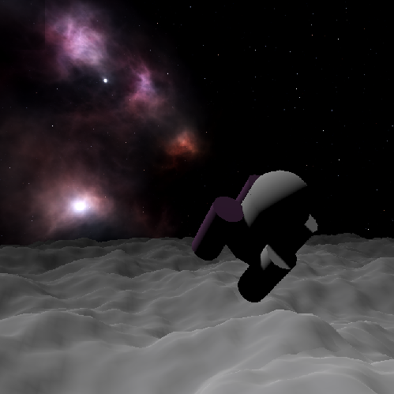

# LLC: Lunar Lander Corporation

A [20 Games Challenge - Summer Jam](https://itch.io/jam/20-games-challenge-summer-jam) entry roughly based on [Lunar Lander](http://moonlander.seb.ly/).

Written by [NoFoxTuGiv](https://github.com/NoFoxTuGiv) and [to-json](https://github.com/to-json) in August 2025.

## Controls:

- Thrust
  - Spacebar
  - A / X / South Button
- Pitch Up
  - Down
  - Back on L Stick
- Pitch Down
  - Up
  - Forward on L Stick
- Yaw Left
  - Left
- Yaw Right
  - Right
- Roll Left
  - Q
  - Left Bumper
- Roll Right
  - E
  - Right Bumper

Control camera with mouse or right stick

## General Concept

A 3D Lunar Lander clone.
